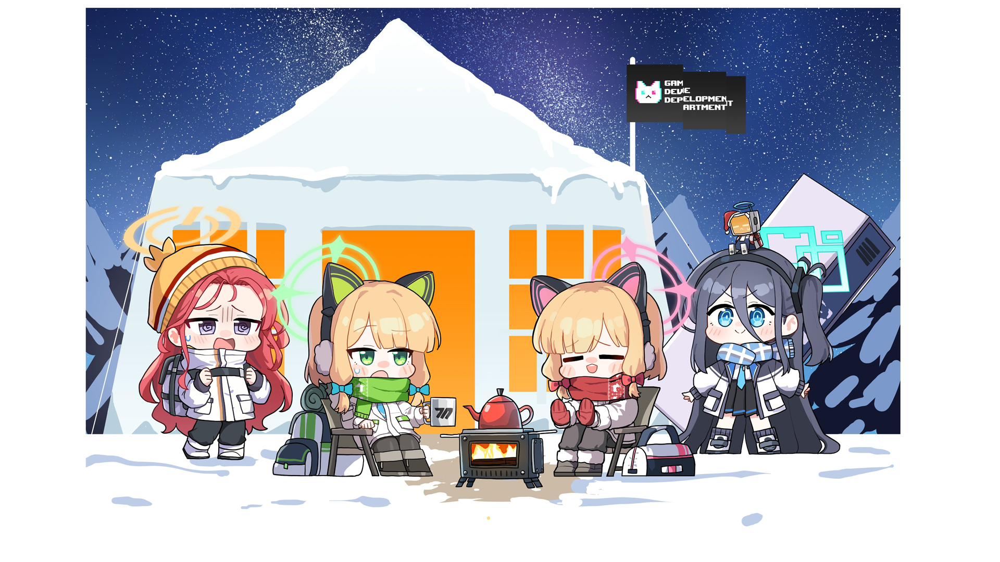

<h1 align="center">Hello Guys 👋, I'm <b>Nurahfezan - NestumMilo</b></h1>
<h3 align="center">🎓I'm on 3rd Year in BCS (Hons) Software Engineering. Just a simple Weeb and Tech Enthusiast.</h3>

  

- 🔭 I’m currently working on simple university project | [MyStudyKPI](https://github.com/NestumMilo-isFezan/mystudykpi-laravel.git)
- 🌱 I’m currently learning **Laravel (TALL Stack), React and Next.js, Svelte and DJango**

⚡FYI : <em>I'm just your regular weeb guy who like plays gacha game and love his waifu a lot.</em>

    
    
    
    

<h3 align="left">Languages and Tools:</h3>

